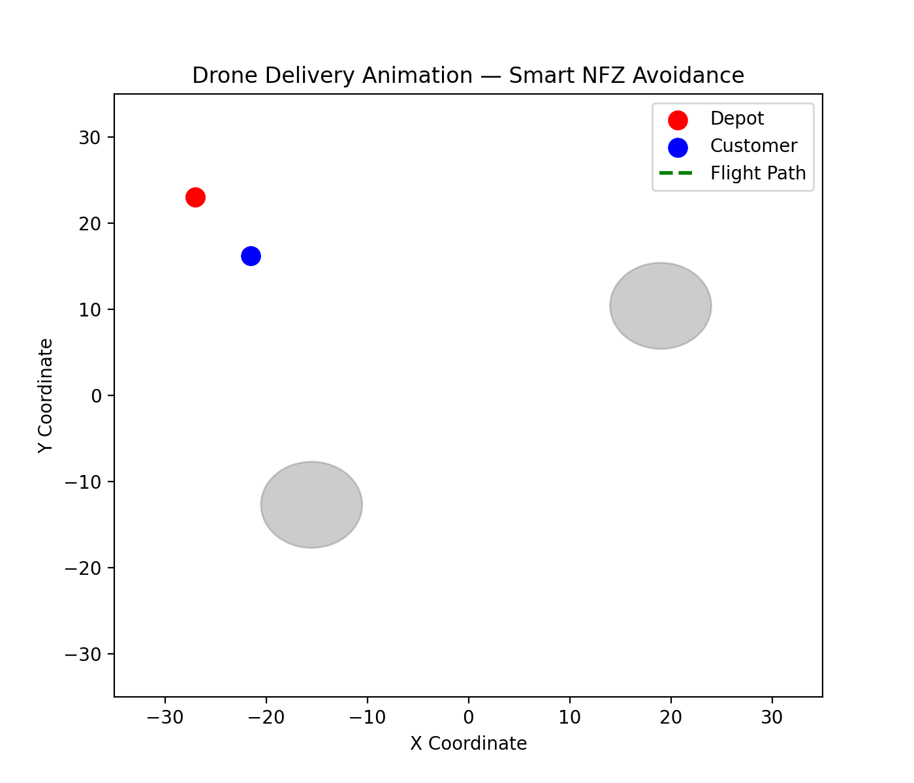

# 🛰️ Drone Delivery Path Helper — Real NFZ Simulation  

**Author:** Murtaza Jamali  
**Reg. No.:** 25BCE0244  
**Course:** Python Project Lab  

---

## Project Overview
This project simulates an **intelligent drone delivery network** that automatically avoids **No-Fly Zones (NFZs)** using real-world research data from *Mao et al., 2023*.  
It processes multiple datasets, cleans and merges them, visualizes the delivery network, and animates drone paths with NFZ awareness.

---

##  Key Features
-  Uses real dataset (*Mao et al., 2023 – Drone Delivery Parameters*)  
-  Cleans and merges raw CSV files with `pandas`  
-  Visualizes delivery networks with and without NFZs  
-  Plots **No-Fly Zones** and integrates avoidance logic  
-  Animated simulation of drone flight paths  
-  Modular, professional folder structure  

---

##  What I Learned
- Working with multi-file datasets and real research data  
- Data cleaning, joining, and preprocessing with **pandas**  
- Advanced visualization and animation using **matplotlib**  
- Structuring Python projects with reusable functions  
- Managing virtual environments and requirements  

---

##  Tech Stack
| Category | Tools Used |
|-----------|-------------|
| **Language** | Python 3.13 |
| **Libraries** | pandas, matplotlib, numpy, os |
| **Visualization** | Matplotlib Animations |
| **Environment** | macOS + VS Code + Virtual Env |

---

## 🗂️ Project Structure
drone_delivery_path_helper/
│
├── src/
│ ├── prepare_dataset.py # Cleans & merges raw data
│ ├── plot_with_nfz.py # Plots NFZ visualization
│ ├── final_plot_with_real_nfz.py # Combined visualization
│ ├── animate_drone.py # Drone animation with avoidance
│
├── data/
│ ├── raw/ # Original Mao et al. dataset
│ └── processed/ # Cleaned CSVs + output visuals
│
├── requirements.txt # Dependencies
└── README.md # Documentation
---

## 📊 Sample Outputs
**Drone Network with Real No-Fly Zones**  


**Drone Animation**  


---

##  Dataset Reference
*Mao et al. (2023)* — “Values of Parameters for Drone Routing.”  
Used for educational and research purposes under fair academic use.

---

##  How to Run
```bash
# 1. Clone the repo
git clone https://github.com/<your-username>/drone_delivery_path_helper.git

# 2. Enter project folder
cd drone_delivery_path_helper

# 3. Activate virtual environment (Mac)
source .venv/bin/activate

# 4. Install dependencies
pip install -r requirements.txt

# 5. Prepare dataset
python3 src/prepare_dataset.py

# 6. Generate visualization
python3 src/final_plot_with_real_nfz.py

# 7. (Optional) Run drone animation
python3 src/animate_drone.py

---------- 

Future Improvements

Implement A* or Dijkstra pathfinding for smarter routing

Add multiple drones with dynamic scheduling

Integrate real map data (OpenStreetMap)

Deploy a simple GUI for live control

🏁 License

Open for educational and academic use.
© 2025 Murtaza Jamali — All Rights Reserved.